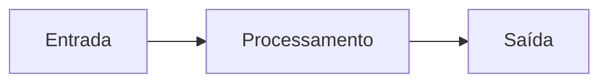

## Programadores são resolvedores de problemas

Antes de escrever código, um programador precisa **entender** o problema e dividi-lo em partes menores.

> [!info]
> Programador não é quem escreve código. É quem resolve problemas — e se precisar, usa código para isso.

O código é a ferramenta, não o objetivo. Essa habilidade de decomposição é mais importante que qualquer linguagem de programação. Um bom programador consegue resolver problemas no papel antes de abrir o editor de código.

## Entrada, processamento e saída

Todo programa segue este fluxo fundamental:

- **ENTRADA** — dados que o programa recebe (teclado, arquivo, sensor, microfone, câmera)
- **PROCESSAMENTO** — operações realizadas sobre os dados (cálculos, comparações, filtragens)
- **SAÍDA** — resultado entregue ao usuário (tela, arquivo, som, LED, impressora)

Mesmo os programas mais complexos (jogos, IA, redes sociais) seguem essa estrutura fundamental.



### Entrada-processamento-saída em TypeScript

Veja como esse fluxo aparece em uma função TypeScript simples que calcula o dobro de um número:

```typescript
function calcularDobro(numero: number): number {
  // ENTRADA: o parâmetro "numero"
  const resultado = numero * 2; // PROCESSAMENTO: multiplicação
  return resultado;             // SAÍDA: o resultado
}

console.log(calcularDobro(5)); // Exibe: 10
```

> [!sucesso]
> Toda função em TypeScript segue o padrão entrada-processamento-saída: os **parâmetros** são a entrada, o **corpo da função** é o processamento, e o **return** é a saída.

## Exemplo: arrumar a casa (decomposição em 4 níveis)

"Arrumar a casa" é um problema grande. Vamos decompor em níveis progressivos:

**NÍVEL 1** — Visão geral: Arrumar a casa

**NÍVEL 2** — Cômodos: Sala, Quartos, Cozinha, Banheiro

**NÍVEL 3** — Tarefas por cômodo:
- Sala: recolher objetos, varrer, passar pano, organizar estante
- Cozinha: lavar louça, limpar fogão, varrer, organizar armários
- Banheiro: limpar vaso, limpar pia, lavar chão, trocar toalhas

**NÍVEL 4** — Subtarefas detalhadas:
- Lavar louça: separar pratos e copos, aplicar detergente, esfregar, enxaguar, secar

Cada nível adiciona mais detalhe. O nível necessário depende de quem vai executar.

### Decomposição em TypeScript

Podemos representar essa decomposição como um programa TypeScript. Cada tarefa vira uma função, e a função principal organiza a sequência:

```typescript
// Nível 4 — subtarefas detalhadas
function lavarLouca(): void {
  console.log("Separar pratos e copos");
  console.log("Aplicar detergente");
  console.log("Esfregar");
  console.log("Enxaguar");
  console.log("Secar");
}

// Nível 3 — tarefas por cômodo
function arrumarSala(): void {
  console.log("Recolher objetos");
  console.log("Varrer");
  console.log("Passar pano");
  console.log("Organizar estante");
}

function arrumarCozinha(): void {
  lavarLouca(); // chama a subtarefa detalhada
  console.log("Limpar fogão");
  console.log("Varrer");
  console.log("Organizar armários");
}

function arrumarBanheiro(): void {
  console.log("Limpar vaso");
  console.log("Limpar pia");
  console.log("Lavar chão");
  console.log("Trocar toalhas");
}

// Nível 1 e 2 — visão geral e cômodos
function arrumarCasa(): void {
  arrumarSala();
  arrumarCozinha();
  arrumarBanheiro();
}

arrumarCasa(); // executa tudo
```

> [!info]
> Perceba como cada **função** corresponde a uma tarefa. A função `arrumarCasa()` não precisa saber os detalhes de como lavar a louça — ela apenas chama `arrumarCozinha()`, que por sua vez chama `lavarLouca()`. Isso é **decomposição** na prática.

## O que é um algoritmo?

Definição formal: "Um algoritmo é uma sequência de tarefas bem definidas e não ambíguas para resolver um problema."

Características de um bom algoritmo:

- **Finito** — tem um número definido de passos e eventualmente termina
- **Definido** — cada passo é claro, sem ambiguidade ("mexa bem" é ambíguo, "mexa por 3 minutos" é definido)
- **Efetivo** — cada passo pode ser executado ("divida por zero" não é efetivo)

Receitas de cozinha, manuais de montagem e roteiros de viagem são algoritmos do dia a dia.

> [!alerta]
> Um algoritmo que nunca termina (não é finito) ou que contém passos impossíveis (não é efetivo) está **incorreto**, mesmo que a lógica pareça certa.
