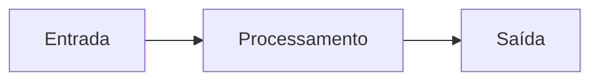

## Programadores são resolvedores de problemas

Antes de escrever código, um programador precisa ENTENDER o problema e dividi-lo em partes menores.

"Uma pessoa que resolve problemas, e se precisar, utiliza código para isso." O código é a ferramenta, não o objetivo.

Essa habilidade de decomposição é mais importante que qualquer linguagem de programação.

> [!info]
> Programador não é quem escreve código. É quem resolve problemas — e se precisar, usa código para isso.

## Entrada, processamento e saída

Todo programa segue este fluxo:

- **ENTRADA** — dados que o programa recebe (teclado, arquivo, sensor, microfone, câmera)
- **PROCESSAMENTO** — operações realizadas sobre os dados (cálculos, comparações, filtragens)
- **SAÍDA** — resultado entregue ao usuário (tela, arquivo, som, LED, impressora)

Mesmo os programas mais complexos (jogos, IA, redes sociais) seguem essa estrutura fundamental.

## Exemplo: arrumar a casa (decomposição em 4 níveis)

"Arrumar a casa" é um problema grande. Vamos decompor em níveis progressivos:

**NÍVEL 1** — Visão geral: Arrumar a casa

**NÍVEL 2** — Cômodos: Sala → Quartos → Cozinha → Banheiro

**NÍVEL 3** — Tarefas por cômodo:
- Sala: recolher objetos, varrer, passar pano, organizar estante
- Cozinha: lavar louça, limpar fogão, varrer, organizar armários
- Banheiro: limpar vaso, limpar pia, lavar chão, trocar toalhas

**NÍVEL 4** — Subtarefas detalhadas:
- Lavar louça: separar pratos e copos → aplicar detergente → esfregar → enxaguar → secar

Cada nível adiciona mais detalhe. O nível necessário depende de quem vai executar.

## O que é um algoritmo?

Definição formal: "Um algoritmo é uma sequência de tarefas bem definidas e não ambíguas para resolver um problema."

Características de um bom algoritmo:

- **Finito** — tem um número definido de passos e eventualmente termina
- **Definido** — cada passo é claro, sem ambiguidade ("mexa bem" é ambíguo, "mexa por 3 minutos" é definido)
- **Efetivo** — cada passo pode ser executado ("divida por zero" não é efetivo)

Receitas de cozinha, manuais de montagem e roteiros de viagem são algoritmos do dia a dia.
