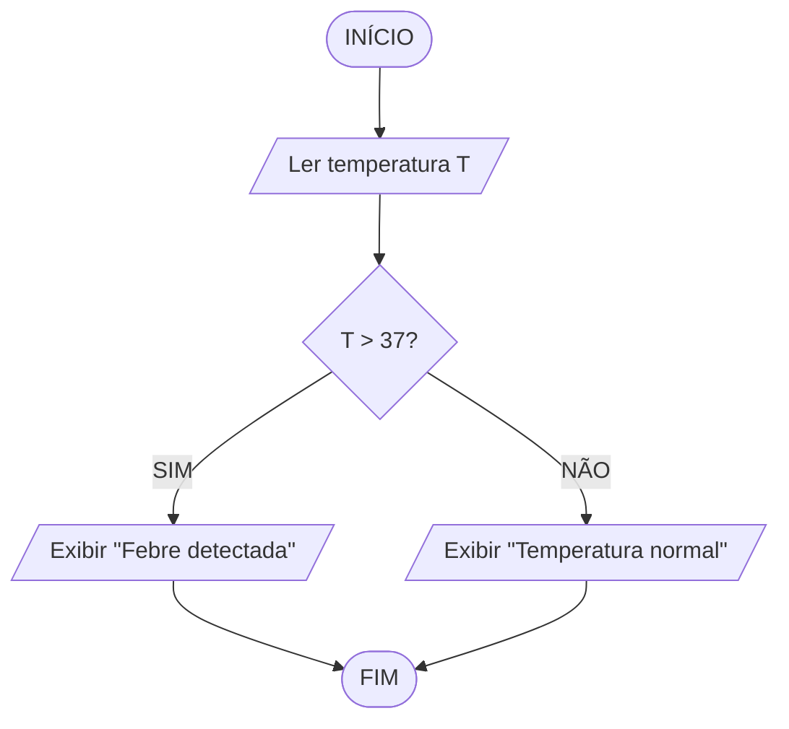
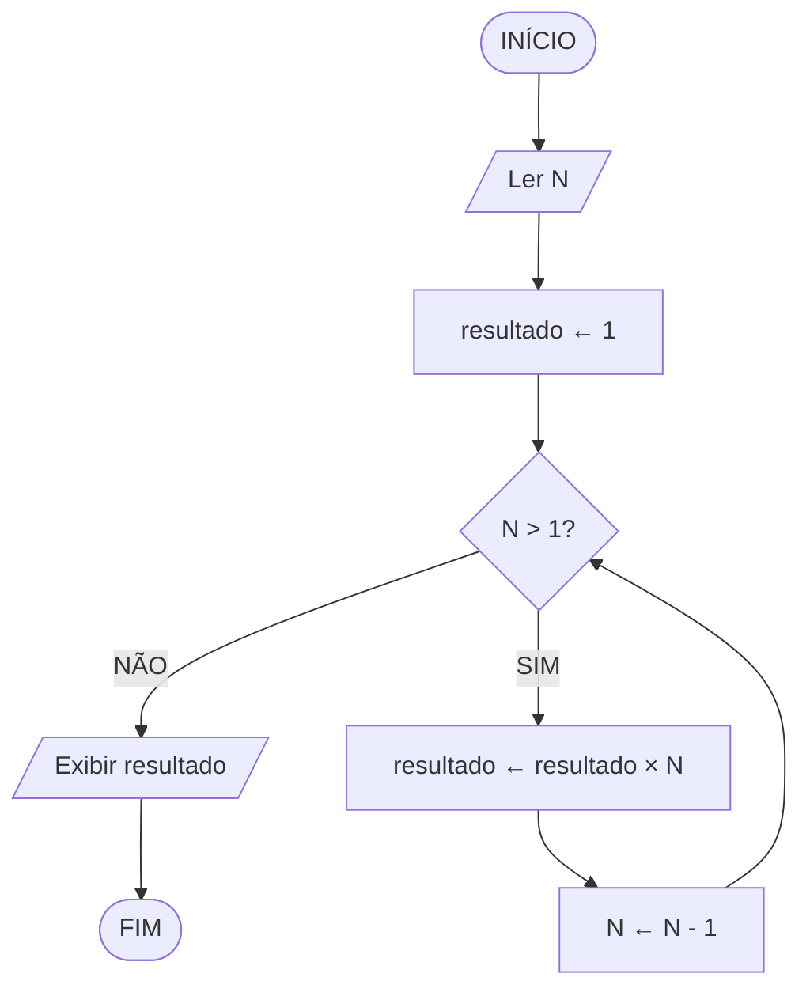

## O que é um fluxograma?

O fluxograma é uma representação gráfica de um algoritmo, usando formas geométricas conectadas por setas.

Cada forma tem um significado específico, criando uma linguagem visual universal.

É mais preciso que a descrição narrativa e mais visual que o pseudocódigo.

## Os 4 símbolos do fluxograma

- **Elipse (oval)** — Início e Fim do algoritmo
- **Retângulo** — Processo/Ação — qualquer operação: calcular, atribuir valor, incrementar
- **Paralelogramo** — Entrada ou Saída de dados — ler do teclado, exibir na tela
- **Losango (diamante)** — Decisão/Teste condicional — sempre com duas saídas: SIM e NÃO
- **Setas** — indicam a direção do fluxo de execução

> [!info]
> O losango (decisão) sempre tem duas saídas: SIM e NÃO. É o equivalente visual do if/else.

## Exemplo 1: soma A + B (linear)

Neste caso simples, não há losangos — o fluxo é totalmente linear.

## Exemplo 2: verificar febre (com bifurcação)

O losango cria dois caminhos possíveis — a bifurcação.

## Exemplo 3: fatorial (com loop)

A seta que volta para cima cria o loop! O losango testa a condição de parada.

> [!alerta]
> Todo loop PRECISA de uma condição de saída, senão o algoritmo nunca termina (loop infinito).
