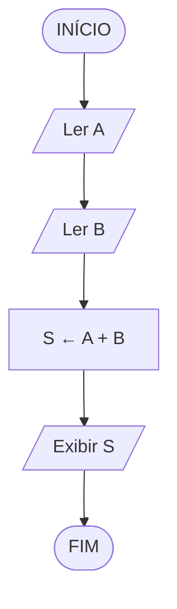

## O que é um fluxograma?

O fluxograma é uma representação gráfica de um algoritmo, usando formas geométricas conectadas por setas.

Cada forma tem um significado específico, criando uma linguagem visual universal. É mais preciso que a descrição narrativa e mais visual que o pseudocódigo.

> [!info]
> Fluxogramas são usados não apenas na programação, mas também em processos empresariais, fluxos de trabalho e documentação técnica.

## Os 4 símbolos do fluxograma

- **Elipse (oval)** — Início e Fim do algoritmo
- **Retângulo** — Processo/Ação — qualquer operação: calcular, atribuir valor, incrementar
- **Paralelogramo** — Entrada ou Saída de dados — ler do teclado, exibir na tela
- **Losango (diamante)** — Decisão/Teste condicional — sempre com duas saídas: SIM e NÃO
- **Setas** — indicam a direção do fluxo de execução

> [!alerta]
> O losango (decisão) sempre tem **duas saídas**: SIM e NÃO. É o equivalente visual do `if/else` em TypeScript.

## Exemplo 1: soma A + B (linear)



Neste caso simples, não há losangos — o fluxo é totalmente linear.

## Exemplo 2: verificar febre (com bifurcação)


O losango cria dois caminhos possíveis — a bifurcação.

## Exemplo 3: fatorial (com loop)


A seta que volta para cima cria o loop! O losango testa a condição de parada.

> [!alerta]
> Todo loop PRECISA de uma condição de saída, senão o algoritmo nunca termina (loop infinito).

## Do fluxograma ao TypeScript

Cada símbolo do fluxograma tem um equivalente direto em TypeScript. Vamos traduzir os três exemplos acima.

### Soma A + B

O fluxo linear (ler, processar, exibir) se traduz diretamente:

```typescript
function somarDoisNumeros(a: number, b: number): number {
  // Ler A e Ler B → parâmetros da função
  const s = a + b;       // Processo: S ← A + B
  return s;              // Exibir S
}

console.log(somarDoisNumeros(3, 7)); // 10
```

### Verificar febre

O losango do fluxograma vira um `if/else`:

```typescript
function verificarFebre(temperatura: number): string {
  // Losango: T > 37?
  if (temperatura > 37) {
    return "Febre detectada";     // Caminho SIM
  } else {
    return "Temperatura normal";  // Caminho NÃO
  }
}

console.log(verificarFebre(38.5)); // "Febre detectada"
console.log(verificarFebre(36.2)); // "Temperatura normal"
```

### Fatorial

A seta que volta no fluxograma vira um `while`:

```typescript
function fatorial(n: number): number {
  let resultado = 1;    // resultado ← 1

  while (n > 1) {       // Losango: N > 1?
    resultado = resultado * n;  // resultado ← resultado × N
    n = n - 1;                  // N ← N - 1
  }                     // Seta volta para o losango

  return resultado;     // Exibir resultado
}

console.log(fatorial(5)); // 120 (5 × 4 × 3 × 2 × 1)
```

> [!sucesso]
> Note a correspondência direta entre os símbolos do fluxograma e o código TypeScript:
> - **Paralelogramo** (ler/exibir) = parâmetros e `console.log`
> - **Retângulo** (processo) = atribuições e cálculos
> - **Losango** (decisão) = `if/else`
> - **Seta que volta** (loop) = `while`
