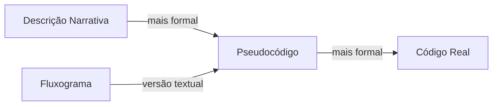

## O que é pseudocódigo?

Pseudocódigo (ou pseudolinguagem) é uma forma de escrever algoritmos que parece com código de programação, mas sem regras rígidas de sintaxe.

Não é executável por computadores — é uma ferramenta para humanos organizarem o raciocínio antes de programar.

> [!info]
> Pseudocódigo é o meio-termo entre a descrição narrativa (muito informal) e o código real (muito formal). É o "rascunho" do programa.

## Variáveis e atribuição com a setinha

Variáveis armazenam valores. No pseudocódigo, usamos a setinha **←** para atribuição:

A setinha ← significa "recebe" ou "armazena". É diferente do = matemático (igualdade).

```pseudocode
programa soma
  ler A
  ler B
  S ← A + B
  escrever S
fim-programa
```

## Palavras-chave do pseudocódigo

As palavras-chave mais comuns:

- `ler` — receber dados de entrada
- `escrever` — exibir dados de saída
- `se...então...senão...fim-se` — estrutura condicional
- `enquanto...faça...fim-enquanto` — loop com teste no início
- `repita...até` — loop com teste no final
- `programa...fim-programa` — delimita o algoritmo

A indentação (recuo) mostra o escopo dos blocos: tudo que está recuado dentro de um "enquanto" pertence ao loop.

## Exemplo: programa fatorial

```pseudocode
programa fatorial
  ler N
  resultado ← 1
  enquanto N > 1 faça
    resultado ← resultado × N
    N ← N - 1
  fim-enquanto
  escrever resultado
fim-programa
```

> [!info]
> Note a indentação: o conteúdo dentro do "enquanto" está recuado, mostrando visualmente que pertence ao loop. Essa prática é obrigatória em Python e recomendada em todas as linguagens.

## Pseudocódigo vs fluxograma



O pseudocódigo é a ponte entre o pensamento lógico e a programação real. Quando você dominar pseudocódigo, traduzir para qualquer linguagem será direto.

## Do pseudocódigo ao TypeScript

A tradução do pseudocódigo para TypeScript é quase direta. Veja o mapeamento das palavras-chave:

| Pseudocódigo | TypeScript |
|---|---|
| `ler` | parâmetros de função ou `prompt()` |
| `escrever` | `console.log()` |
| `←` (atribuição) | `=` |
| `se...então` | `if (...) {` |
| `senão` | `} else {` |
| `fim-se` | `}` |
| `enquanto...faça` | `while (...) {` |
| `fim-enquanto` | `}` |
| `programa...fim-programa` | `function ...() { }` |

### Soma em pseudocódigo vs TypeScript

**Pseudocódigo:**
```pseudocode
programa soma
  ler A
  ler B
  S ← A + B
  escrever S
fim-programa
```

**TypeScript:**
```typescript
function soma(a: number, b: number): void {
  const s = a + b;     // S ← A + B
  console.log(s);      // escrever S
}

soma(10, 20); // Exibe: 30
```

### Fatorial em pseudocódigo vs TypeScript

**Pseudocódigo:**
```pseudocode
programa fatorial
  ler N
  resultado ← 1
  enquanto N > 1 faça
    resultado ← resultado × N
    N ← N - 1
  fim-enquanto
  escrever resultado
fim-programa
```

**TypeScript:**
```typescript
function fatorial(n: number): void {
  let resultado = 1;          // resultado ← 1

  while (n > 1) {             // enquanto N > 1 faça
    resultado = resultado * n; //   resultado ← resultado × N
    n = n - 1;                 //   N ← N - 1
  }                            // fim-enquanto

  console.log(resultado);      // escrever resultado
}

fatorial(5); // Exibe: 120
```

### Exemplo com condicional

**Pseudocódigo:**
```pseudocode
programa verificarIdade
  ler idade
  se idade >= 18 então
    escrever "Maior de idade"
  senão
    escrever "Menor de idade"
  fim-se
fim-programa
```

**TypeScript:**
```typescript
function verificarIdade(idade: number): void {
  if (idade >= 18) {                  // se idade >= 18 então
    console.log("Maior de idade");    //   escrever "Maior de idade"
  } else {                            // senão
    console.log("Menor de idade");    //   escrever "Menor de idade"
  }                                   // fim-se
}

verificarIdade(20); // "Maior de idade"
verificarIdade(15); // "Menor de idade"
```

> [!sucesso]
> Perceba como a estrutura do pseudocódigo e do TypeScript é praticamente idêntica. A diferença principal é que no TypeScript usamos `=` em vez de `←`, chaves `{ }` em vez de `fim-...`, e declaramos os tipos das variáveis (`: number`, `: void`).
